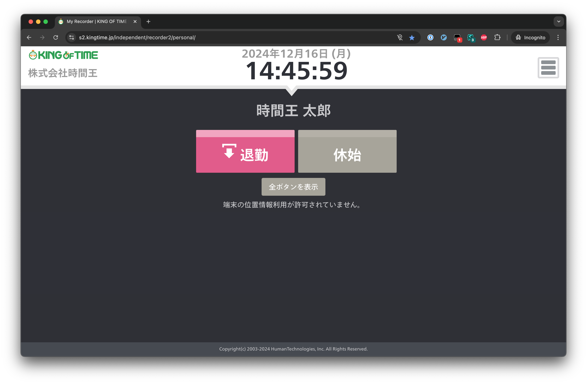

# KING OF TIME Enhanced

Chrome 拡張: KING OF TIME を使いやすくします

[Chrome Web Store](https://chromewebstore.google.com/detail/king-of-time-enhanced/dmnmihmggaijobmncbddaopcoddakdeh)

> [!NOTE]
> 作者の所属組織以外の環境で動作するかは未確認です  
> Issue への報告、Pull Request などは歓迎しています

## 機能

### 打刻画面でそのとき押せるボタンのみを表示
  - 例えば勤務中には「退勤」「休憩開始」ボタンのみが表示され、休憩中には「休憩終了」ボタンのみが表示されます
  - 一度打刻したあとはリロードすると再反映されます
  - 打刻を忘れていたなどの理由で押したいボタンが表示されていないときは「全ボタンを表示」ボタンを利用してください
  - スマホなど別端末から行った打刻も考慮されます

### `?timecard` クエリがついている場合タイムカードページにリダイレクト
  - `https://s2.kingtime.jp/independent/recorder2/personal/?timecard` のようなリンクにアクセスした場合、自動的にタイムカードページへ移動します
  - ブックマークして使うと便利です

### 打刻画面の各種モーダルを Esc キーで閉じる
